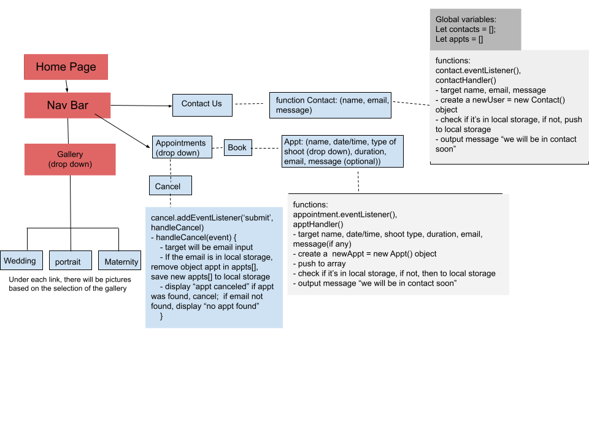
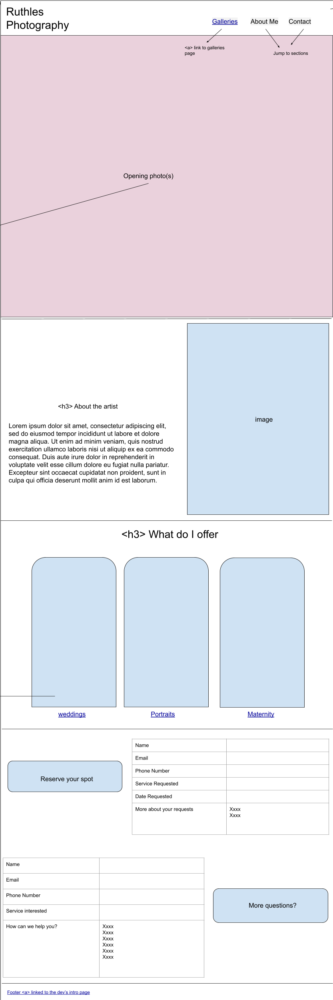
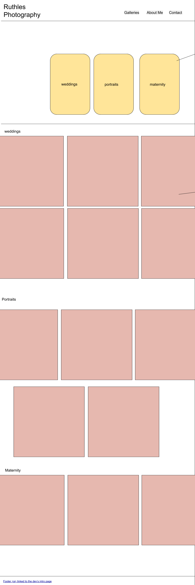
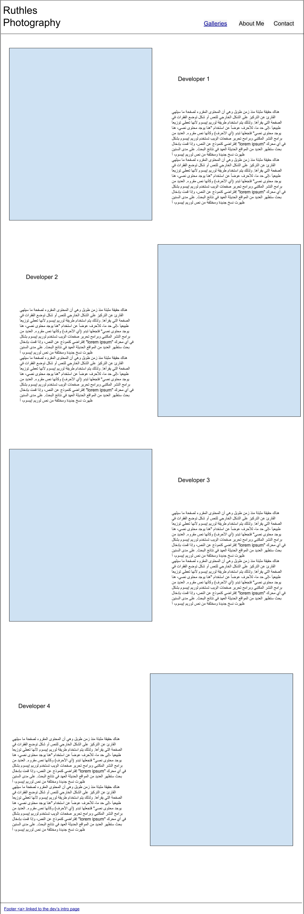

# readme for Ruth.Les Photography

## Creators

- Kirill Lesnykh
- Phil Chaplin
- Miranda Lu
- Nate Brown

## Project Summary

- Photographer's site that displays and allows contacts from potential customers.

- Problem this site intends to solve:
  - The business has no existing website for contact/scheduling

- MVP: schedule appointment (calendar), see previous work, gallery, contact info (forms)

## User Stories

1. Schedule an appointment

2. As a user, I want to be able to schedule an appointment for a photography session. 

3. Feature Tasks:
    - Choose a date and time
    - Choose the type/category of photography session

4. Acceptance Tests:
    - Ensure that the appointment successfully saves in local storage
    - Properly display errors to the user if data does not save.
    - Validate proper user input for appointment.

1. Cancel Appointment

2. As a user, I want to be able to cancel an appointment.

3. Feature Tasks:
    - Find your appointment and cancel it

4. Acceptance Tests:
    - The canceled appointment is removed from local storage

    
1. User Story: Contact the photographer

2. As a user, I want to be able to contact the photographer to ask questions or get more information before making an appointment.

3. Feature Tasks
  a. Provide a form with fields for user's contact information (email and/or phone number).
  b. Provide a paragraph-size text box where the user can input what specific information they are seeking, so that when the photographer contacts me back, both are already on the same page.
  c. After completing the form, respond to the user with an estimated time to receive a response.

4. Acceptance Tests
   a. Ensure that the user inputs a valid phone number.
   b. Ensure that the user inputs a valid email address.
   c. Ensure that the user inputs a message for the photographer (no blank text box).

Albums:

- Title: Wedding photo albums
- User story: as a new bride, I want to see couples recording their happiest moments on their special day, so that I would like to book the same that's worth the money for my wedding.
- Feature tasks: showcase couples under different settings, group by settings (ex. forest, farmhouse)
- Acceptance tests: clearly defined sections, (possibily auto-pay or scrollable photo albums)

- Title: Portrait photo albums
- User story: as a potential customer, I want to see how the artist portray people celebrating their significant milestones, so I can find an artist that suits my moments. I would like to see different styles of portrait the photographer does, and what the photographer specializes in.
- featured tasks: showcase different styles of portraits (ex. professional, graduation, senior)
- Acceptance tests: clearly defined sections (possibily auto-pay or scrollable photo albums)

- Title: Baby photo albums
- User story: as a new mom, I want to see how the artist illustrate new-borns, and I would like to be able to scroll through her photos so I have an overview of the age range of the baby photo she typically takes
- featured tasks: showcase typical baby photos
- Acceptance tests: show baby photos in a single section

### UML

### WireFrames

- Home

- Gallery

- Developers
